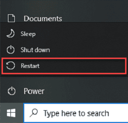
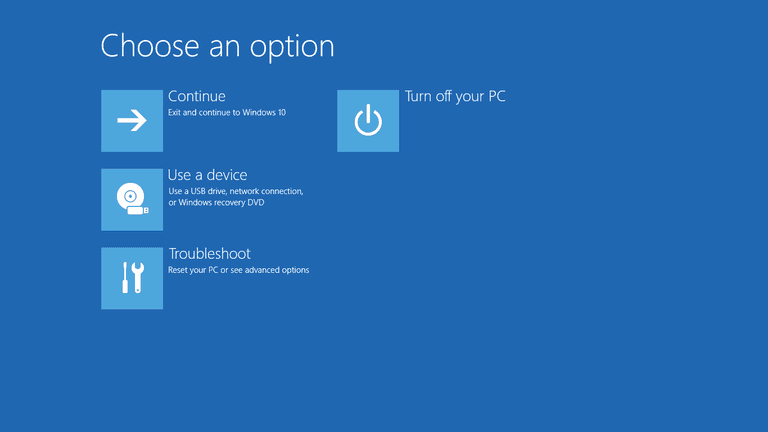
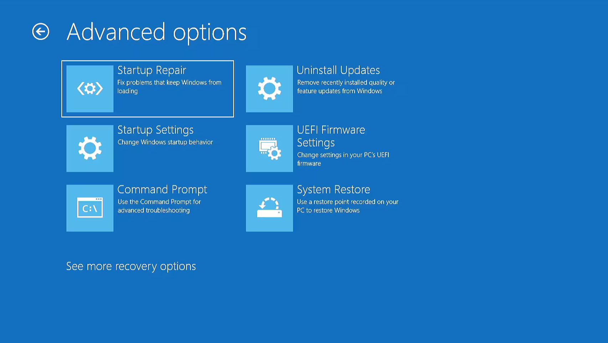
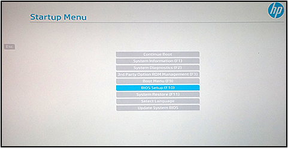
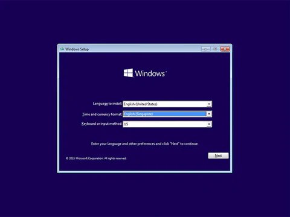
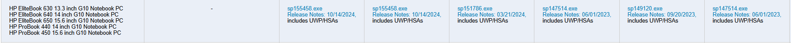

# Windows Reinstall Guide
## Key Terms

- BIOS (Basic Input/Output System): Tells your computer how to operate; essentially a very low-level settings menu for your computer.
- UEFI (Unified Extensible Firmware Interface) Settings: A more modern version of BIOS. As far as HP devices are concerned, they should be literally the same but with different UI styles.
- Boot Order: Controls which device the operating system is loaded from. In this case, we will boot onto a flash drive.
- Secure Boot: A security feature that ensures the computer doesn't boot into malicious software. It comes with the drawback of occasionally preventing us from booting into a Windows installer.
- Network Boot: The process of booting a computer from the network rather than a drive. This must also be disabled to ensure we boot into the drive properly (or at least ensure it isn't prioritized).
- Installation Media: In this case, the bootable USB, used to reinstall Windows.
- Disk Partitions: A partition is a logical division of a drive. They are useful for installing multiple operating systems. Most of the time, if you are only reinstalling Windows (with a single drive installed), you delete all of your drive partitions and create a new one to install Windows on after formatting.

## Preparing Bootable Flash Drive

1. Visit the [Windows 11 download site](https://www.microsoft.com/software-download/windows11) (Alternatively visit the [Windows 10 download site](https://www.microsoft.com/software-download/windows10)) and select the "Download Now" button under "Create Windows Installation Media."
2. **MAKE SURE THAT YOU HAVE MOVED EVERYTHING YOU NEED FROM THE FLASH DRIVE BEFORE PROCEEDING.***
3. Accept the privacy policy, use the recommended settings, select "USB Flash Drive," and click on your flash drive (**This step may need to be completed using a separate computer with admin access if it asks for a password when running on your laptop.**)
4. Once the setup is done, you should see a few files added to your drive. If you didn't see your drive in the list, or it seems empty, there was likely some issue with your drive. The most common fix is to format the drive by right clicking it and selecting "format drive."

## Preparing Your Computer

*NOTE: My memory is honestly a little fuzzy, so I'm not certain if it will boot you into the Windows start menu or the HP (mobo manufacturer) boot menu. Look at the note after step 3 if you boot into a white menu rather than a blue menu.*

In addition, a strange issue with the firmware drivers on many laptops prevents the use of the trackpad or Wi-Fi during setup, so you may need to plug into Ethernet or use a mouse. If you don't have Ethernet, it's possible to start up Windows a Microsoft Account, so you don't need any connection. If you don't have a mouse, use the tab key to navigate to the next field, Shift + Tab to go the previous field, the arrows keys to move within each field, and the enter key to select an option (there is one checkbox field that you have to use the space key to select).

1. **Move all of your files before reinstalling because your computer will be completely wiped. You will have to reinstall all of your apps after the installation.**
2. Boot into your computer's start menu by holding shift and clicking the restart button (This should bring you to the menu automatically, but for good measure, hit the escape key while your computer is restarting).

3. You should boot into a menu that looks like the one below. Select the "Troubleshoot" option, then choose "UEFI Firmware Settings" and "Restart."

***NOTE***: If you boot into the menu below instead, you can simply select "BIOS Setup" to access the UEFI/BIOS settings.

*I apologize in advance for the lack of photos in this section.*

4. Navigate to the "Advanced" tab at the top and choose "Boot Options" then deselect "Network (PXE) Boot" if it's enabled.
5. Go to the "Security" tab, select "Secure Boot Configuration," then uncheck "Secure Boot."
6. Go back to the "Main" tab then choose "Save Changes and Exit."

## Reinstalling Windows

1. You should now be able to repeat [steps 1 and 2 from the previous section](#preparing-your-computer), then choose "Boot Menu" or "Use a device" to boot into your USB flash drive (just select the option that looks to have a matching name with your flash drive).
2. You should now see a menu that looks like the image below. Go through all of the installation steps (refer to the movement key bindings at the top of the [previous section](#preparing-your-computer)).

3. When asked for a product key, skip it by saying you will enter one later. Afterward, on the privacy policy page with a checkbox, either use a mouse to check the box or hit tab until you are focusing on the checkbox field and hit space.
4. Select custom install and delete every partition (if you have other operating systems installed or multiple drives, this step will look a little different for you, but hopefully, you already understand how to work with disk partitions).
5. Create a new partition by selecting "New" and click "Next."
6. After waiting for the Windows installation, you should be asked to connect to a network. If you have access to Ethernet, continue to the login. Otherwise, you should be able to skip the connection and continue to the operating system without a connection.

## Fixing Touchpad and Wi-Fi Drivers

There are two ways to fix being unable to use your track pad or Wi-Fi. The first requires you to install drivers on a separate computer with access to internet, transferring it to a flash drive, then transferring and running the driver installation files on your laptop.

***Offline Installation***
Go to the HP [driver packs page](https://hpia.hpcloud.hp.com/downloads/driverpackcatalog/HP_Driverpack_Matrix_x64.html) on a separate device with an internet connection. Using Ctrl+F find "HP ProBook 450 15.6 inch G10 Notebook PC." Choose the newest release version (24H2) for your corresponding operating system (Windows 10 or 11). Move the downloaded `.exe` file to your flash drive and transfer the file over to your laptop. Follow the installation instructions, and your issues should be fixed.  

***Installation With Internet Access***
I found that the easiest way to install drivers with an internet connection (likely through Ethernet) is to go to the UEFI settings (refer to [Preparing Your Computer Steps 1-3](#preparing-your-computer)), go to the "Main" tab, select "Update System BIOS," then finally choose "Check HP.com for BIOS Updates." When it mentions that BitLocker has to be suspended, select "continue" and follow through with the driver installation. After the installation is complete, restart your computer and everything should be fixed.