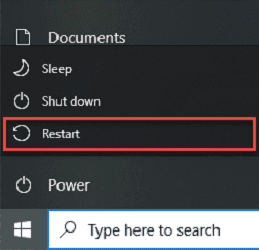
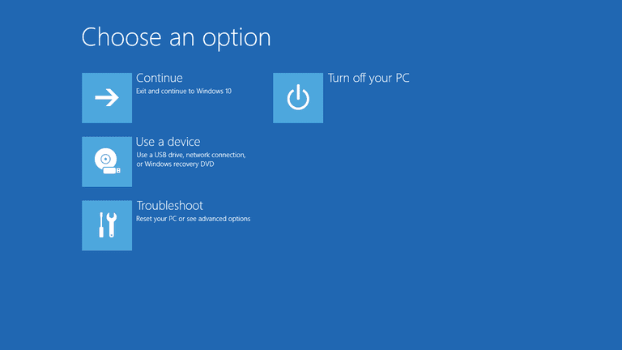
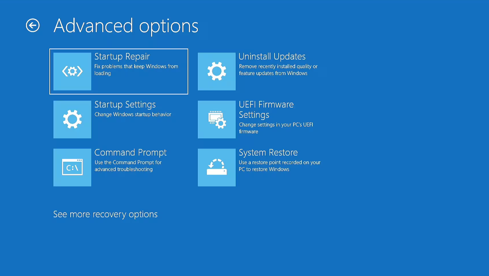
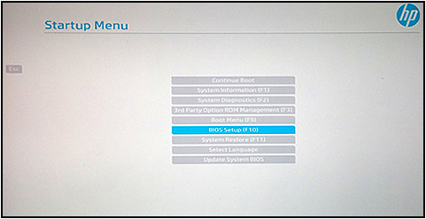
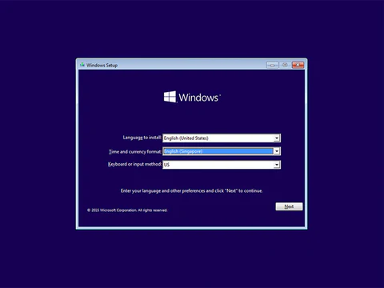

# Windows Reinstall Guide

## Key Terms

- **BIOS (Basic Input/Output System):** Tells your computer how to operate; a low-level settings menu for hardware initialization.
- **UEFI (Unified Extensible Firmware Interface):** Modern replacement for BIOS. On HP devices, it appears similar but with a different UI.
- **Boot Order:** Determines which device the system boots from. We will set this to a USB drive.
- **Secure Boot:** Security feature that prevents unauthorized operating systems from booting. May block installation media in some cases.
- **Network Boot (PXE):** Boots from the network instead of a drive. Should be disabled or deprioritized.
- **Installation Media:** A bootable USB drive used to install Windows.
- **Disk Partitions:** Logical sections of a drive. Used to install or separate operating systems.

---

## Preparing Your Bootable Flash Drive

1. Visit the Windows download page:
   - https://www.microsoft.com/software-download/windows11  
   - https://www.microsoft.com/software-download/windows10  
2. Click **Download Now** under “Create Windows Installation Media.”
3. **Make sure you back up your USB drive first. Everything on it will be erased.**
4. Run the tool:
   - Accept the license agreement
   - Select **“Create installation media (USB flash drive)”**
   - Choose your flash drive

   (You may need another computer with admin access depending on permissions.)
5. After completion, verify the USB contains Windows installation files. If not, reformat the drive and retry.

---

## Preparing Your Computer (HP Example)

> BIOS keys vary by manufacturer:
- HP: `Esc` then `F10`
- Dell: `F2`
- Lenovo: `F1` or `F2`
- ASUS: `F2` or `Delete`

1. **Back up your files. This process will completely wipe your system.**
2. Enter recovery mode:

   - Hold **Shift + Restart**

   
   
4. Navigate:

   - Troubleshoot → Advanced Options → UEFI Firmware Settings → Restart

   

   

   If you see a boot menu instead.
   
   

   You can select **BIOS Setup** directly.
6. In BIOS/UEFI:
   - Go to **Advanced → Boot Options**
   - Disable **Network (PXE) Boot**
7. Go to **Security → Secure Boot Configuration**
   - Disable Secure Boot only if required (e.g., “Security policy violation” errors or BitLocker issues)
8. Save changes and exit.

---

## Reinstalling Windows

1. Reboot and enter boot menu:
   - On HP: press `Esc`, then select Boot Menu
   - Choose your USB drive
2. Windows installer should appear:

   
3. Installation steps:
   - Select language and region
   - Click Install
   - When asked for a product key, select **“I don’t have a product key”**

   You can obtain activation keys here if needed:
   https://massgrave.dev/
4. **Offline installation (no Wi-Fi required):**
   - Press **Shift + F10**
   - Type:
     ```
     OOBE\BYPASSNRO
     ```
   - Press Enter
   - The system will restart and allow you to continue without internet
5. Choose **Custom Install**
6. **Partition setup:**
   - Delete all partitions **except the USB drive**
   - (If you have another OS you want to keep, do NOT delete its partition)
   - Select the unallocated space
   - Click **New → Apply → Next**
7. Wait for Windows to install and reboot.

---

## After Installation (Important)

1. Connect to the internet (if not already connected).
2. Run Windows Update:
   - Settings → Windows Update → Check for updates
   This will automatically install most drivers (Wi-Fi, chipset, touchpad, etc.).

---

## Fixing Touchpad and Wi-Fi Drivers (If Needed)

If Windows Update does not install all drivers automatically, or if you are unable to connect to the internet after installation:

1. First, try running:
   - **Settings → Windows Update → Check for updates**
   This will usually install most drivers automatically (Wi-Fi, Ethernet, chipset, touchpad, etc.).
2. If you still cannot connect to the internet:
   - You will need to manually install either the **Wi-Fi driver or Ethernet driver first** so you can get online
   - Once internet access is restored, run **Windows Update** again to automatically install the remaining drivers
3. If you need manufacturer driver packs as a fallback (example for HP laptops):
   - HP Driver Pack Catalog:  
     https://hpia.hpcloud.hp.com/downloads/driverpackcatalog/HP_Driverpack_Matrix_x64.html
   - Example device (for reference only):  
     **HP ProBook 450 15.6 inch G10 Notebook PC**
4. Download the correct driver pack for your system version (Windows 10 or Windows 11), transfer it via USB, and install it.
5. After internet access is restored, run Windows Update again to finish driver installation automatically.

---

## Notes

- BIOS keys may differ depending on your device model.
- Secure Boot usually does not need to be disabled unless installation errors occur.
- Windows Update should be run immediately after installation for drivers.
- Partition deletion is irreversible—double check before proceeding.
- Avoid installing after a Linux distro since it will overwrite the bootloader, and require you to chroot into your system or use another technique to recover the ability to boot into Linux.
